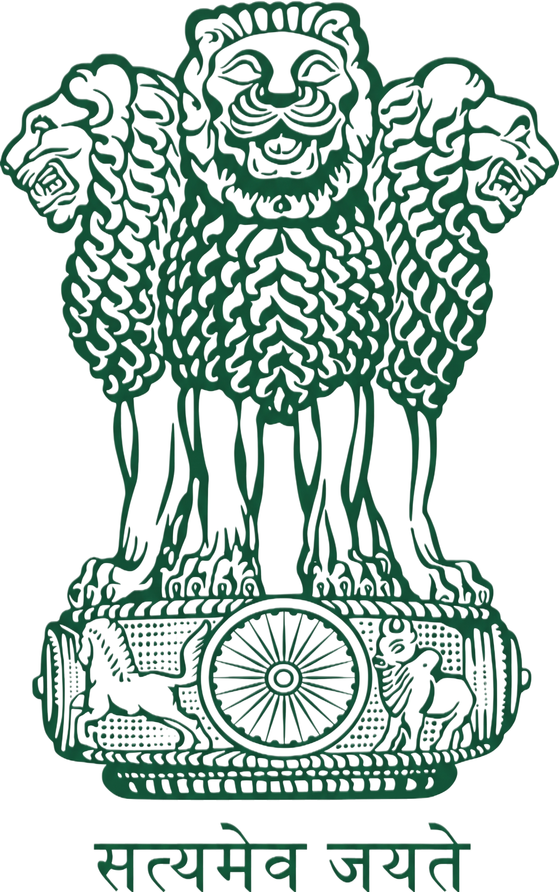

# GovAid 🇮🇳

> **A modern citizen welfare portal** — connecting every Indian citizen to government schemes they are eligible for, instantly.



---

## 📋 Overview

GovAid is a full-stack web application that bridges the gap between citizens and government welfare schemes. Citizens can register, get automatically matched to schemes based on their profile, apply with one click, and track their applications — all in one place.

An **Admin Console** provides government officials with real-time analytics, citizen management, and the ability to approve or reject applications directly.

---

## ✨ Features

### Citizen Portal
- 🔐 **Secure Registration & Login** — Aadhaar-linked citizen profiles
- 🎯 **Smart Eligibility Engine** — Automatically matches citizens to schemes based on age, income, gender, and occupation
- 📂 **Scheme Directory** — Browse all active schemes with category filters and live search
- 🗂️ **Life Events Filter** — Find relevant schemes by life situation (Marriage, Pregnancy, Buying a House, etc.)
- 📋 **My Applications** — Track all submitted applications with real-time status updates
- 👤 **Profile Dashboard** — Full citizen data display including Aadhaar (masked), income, occupation, and contact details
- 🎉 **Eligibility Banner** — Instant notification of how many schemes a citizen qualifies for on login

### Admin Console
- 🛡️ **Secure Admin Login** — Separate admin authentication
- 📊 **Analytics Dashboard** — Total citizens, applications, pending reviews, gender/occupation distribution
- 📈 **Visual Charts** — Bar charts for top applied schemes, donut charts for demographics
- 👥 **Citizen Registry** — Searchable table of all registered citizens
- ✅ **Application Management** — Approve or reject applications with one click, writes back to DB instantly
- 📜 **Schemes Directory** — Admin view of all active schemes with categories and benefits

---

## 🏗️ Tech Stack

| Layer | Technology |
|---|---|
| **Frontend** | HTML5, Vanilla CSS, Vanilla JavaScript |
| **Backend** | Node.js, Express.js |
| **Database** | MySQL (via `mysql2`) |
| **Icons** | Lucide Icons |
| **Fonts** | Hedvig Letters Serif + Inter (Google Fonts) |
| **Auth** | bcryptjs (password hashing) |
| **Config** | dotenv |

---

## 📁 Project Structure

```
GovAid/
├── backend/
│   ├── server.js          # Express API server (all routes)
│   ├── db.js              # MySQL connection pool
│   ├── .env               # Environment variables (not committed)
│   └── package.json
├── frontend/
│   ├── index.html         # Landing / Home page
│   ├── login.html         # Citizen login
│   ├── signup.html        # Citizen registration
│   ├── dashboard.html     # Citizen dashboard
│   ├── admin-login.html   # Admin login
│   ├── admin.html         # Admin dashboard
│   ├── app.js             # Frontend JavaScript
│   └── style.css          # Global design system
└── src/
    ├── server/
    │   └── GovAidServer.java
    └── service/
        └── EligibilityEngine.java
```

---

## 🚀 Getting Started

### Prerequisites
- Node.js v18+
- MySQL 8.0+

### 1. Clone the repository
```bash
git clone https://github.com/nananananani/GovAid.git
cd GovAid
```

### 2. Set up the database
Import your MySQL schema into a database named `GovAid_DB`.

### 3. Configure environment variables
Create `backend/.env`:
```env
DB_HOST=localhost
DB_USER=root
DB_PASSWORD=your_password
DB_NAME=GovAid_DB
PORT=8080
```

### 4. Install dependencies and run
```bash
cd backend
npm install
node server.js
```

### 5. Open in browser
```
http://localhost:8080
```

---

## 🔑 Default Credentials

| Role | Username / Email | Password |
|---|---|---|
| Admin | `admin` | `admin` |
| Demo Citizen | Use signup page | — |

---

## 📡 API Routes

| Method | Endpoint | Description |
|---|---|---|
| `POST` | `/api/signup` | Register a new citizen |
| `POST` | `/api/login` | Citizen login |
| `GET` | `/api/profile` | Get citizen profile |
| `GET` | `/api/schemes` | All schemes with eligibility flag |
| `GET` | `/api/eligibility` | Eligible schemes for citizen |
| `GET` | `/api/categories` | All scheme categories |
| `GET` | `/api/life-events` | Life events with linked schemes |
| `POST` | `/api/apply` | Apply for a scheme |
| `GET` | `/api/applications` | Citizen's applications |
| `POST` | `/api/admin/login` | Admin authentication |
| `GET` | `/api/admin/stats` | Dashboard analytics |
| `GET` | `/api/admin/citizens` | All citizens (searchable) |
| `GET` | `/api/admin/applications` | All applications |
| `PUT` | `/api/admin/applications/:id/status` | Update application status |

---

## 🎨 Design System

- **Primary colour:** `#1F514C` (Emerald Teal)
- **Background:** `#EEEEF2` (Soft grey — easy on the eyes)
- **Surface:** `#F5F6F8`
- **Typography:** Hedvig Letters Serif (headings) + Inter (body)
- **Border radius:** `32px` cards, `100px` pills

---

## 📄 License

This project is for educational purposes.

---

<p align="center">Built with ❤️ for every citizen of India</p>
